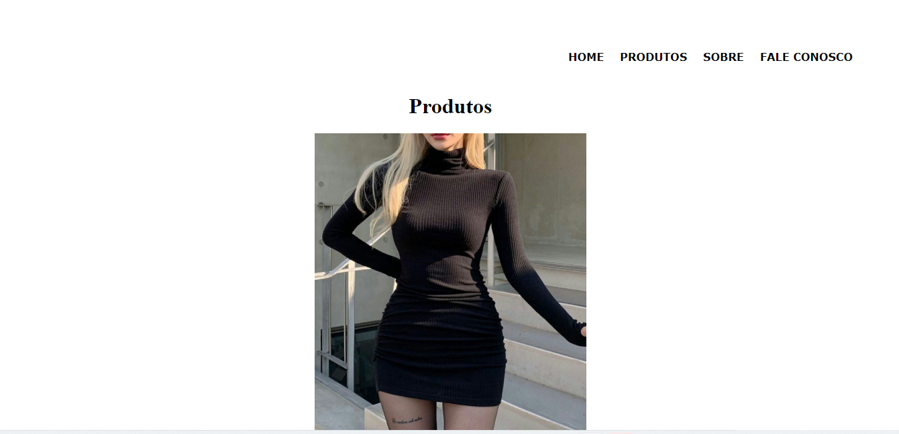

# Projeto- Site de Produtos
Fizemos esse projeto para aprender a como fazer um site 

# Começando
É um site que vende vestidos para festa, vestidos simples, vestidos para passeio, vestidos para toda a ocasião que você precisar.

# Instalação 
Comandos que usamos para criar esse projeto 
1- index.html 
2- home.html
3- produtos.html
4- fale-conosco.html 
5- sobre.html

# Construido com
Esse site foi construido com...
HTML
CSS

# Autores 
Todos que ajudaram a levantar o projeto desde o início
- Geovana Lima - desenvolvedora 

